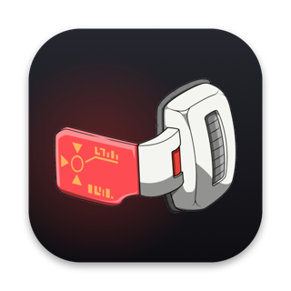

<p align="center">
  
</p>

# Scouter

A small screenshot tool for the macOS menu bar, in the spirit of CleanShot X. It captures an area, a window, the whole screen, or a long page by scrolling for you and stitching the frames together. Every capture is saved as a PNG and copied to the clipboard.

Built for personal use. It runs locally and makes no network calls.

## What it does

| Shortcut | Capture |
|---|---|
| Ctrl+Shift+1 | Drag to select an area. Press Space to switch to picking a window, then click one. Esc cancels. |
| Ctrl+Shift+2 | The whole display under the mouse. |
| Ctrl+Shift+3 | Scrolling capture. Select the part of the page to capture, and Scouter scrolls it and stitches the frames into one tall image. Esc stops early and keeps what it has. |

The same actions are in the menu bar icon, along with **Save To…** for picking the folder (Desktop by default) and **Open Screenshots Folder**.

Files are named like `Scouter 2026-09-30 at 14.03.22.png` and saved at Retina resolution with 144 dpi, so they open at their on-screen size.

## Requirements

- macOS 14 or later
- Xcode or the Command Line Tools (`xcode-select --install`). The project builds with Swift Package Manager and doesn't need an Xcode project.

## Build and run

```bash
scripts/bundle.sh        # builds a release binary and wraps it in Scouter.app
open Scouter.app
```

To keep it around, copy `Scouter.app` to `/Applications` and add it under System Settings > General > Login Items.

### Permissions

macOS asks for two permissions the first time:

- **Screen & System Audio Recording**, for every capture.
- **Accessibility**, for scrolling capture only, because Scouter posts scroll events and listens for Esc.

Turn Scouter on in System Settings > Privacy & Security for each, then quit and reopen it.

macOS ties these grants to the app's code signature, and an ad-hoc signature changes on every build. So without a signing certificate you'll re-grant after each rebuild. To avoid that, create one once in Keychain Access: Certificate Assistant > Create a Certificate, name it `Scouter Dev`, set Identity Type to Self Signed Root and Certificate Type to Code Signing, then set it to Always Trust. `bundle.sh` uses it when it finds it.

If a grant gets stuck, reset it and reopen the app:

```bash
tccutil reset ScreenCapture dev.local.scouter
tccutil reset Accessibility dev.local.scouter
```

## How scrolling capture works

Scouter captures the selected area, posts a scroll event at its center, waits 300 ms and captures again. For each new frame it hashes every row and looks for the offset where the previous frame's rows line up with the new one's. Only the new rows get appended.

Sticky headers and footers are detected two ways: rows that stay identical in place, and rows at the edges that change every frame, like a blurred see-through header. Either way they appear once in the final image. The capture stops at the end of the page, after 20,000 px, when frames stop lining up, or when you press Esc. If the first scroll doesn't move anything, it tries the other direction once, which covers natural scrolling.

## Project layout

```
Sources/ScouterCore/   pure logic, no UI: overlap detection, scroll session, stitching,
                       coordinate conversion, window hit-testing, file naming, settings
Sources/Scouter/       AppKit and ScreenCaptureKit glue: menu bar, overlay, capture, hotkeys
Tests/ScouterCoreTests Swift Testing suite for the core
scripts/bundle.sh      build and package Scouter.app
scripts/test.sh        run the tests
scripts/make-icon.swift regenerate the app and menu bar icons from Resources/scouter-source.jpg
```

## Tests

```bash
scripts/test.sh
```

With only the Command Line Tools installed, SwiftPM doesn't find the Swift Testing framework on its own. The script passes the extra search paths, so use it instead of plain `swift test`.

## Icon

To change the icon, swap `Resources/scouter-source.jpg` and run `swift scripts/make-icon.swift`.

## Disclaimer

Scouter is a personal, non-commercial fan project. It is not affiliated with, endorsed by, or connected to Dragon Ball, Akira Toriyama, Bird Studio, Shueisha, Toei Animation or any of their partners. Dragon Ball, the scouter design and all related names and artwork belong to their respective owners. We don't own any of it.

The icon art is fan art found online and is used here only as a personal app icon. The name is a nod to the show, nothing more. Nothing here is for sale or distribution. If you're a rights holder and want anything removed, open an issue and it'll be taken down.
